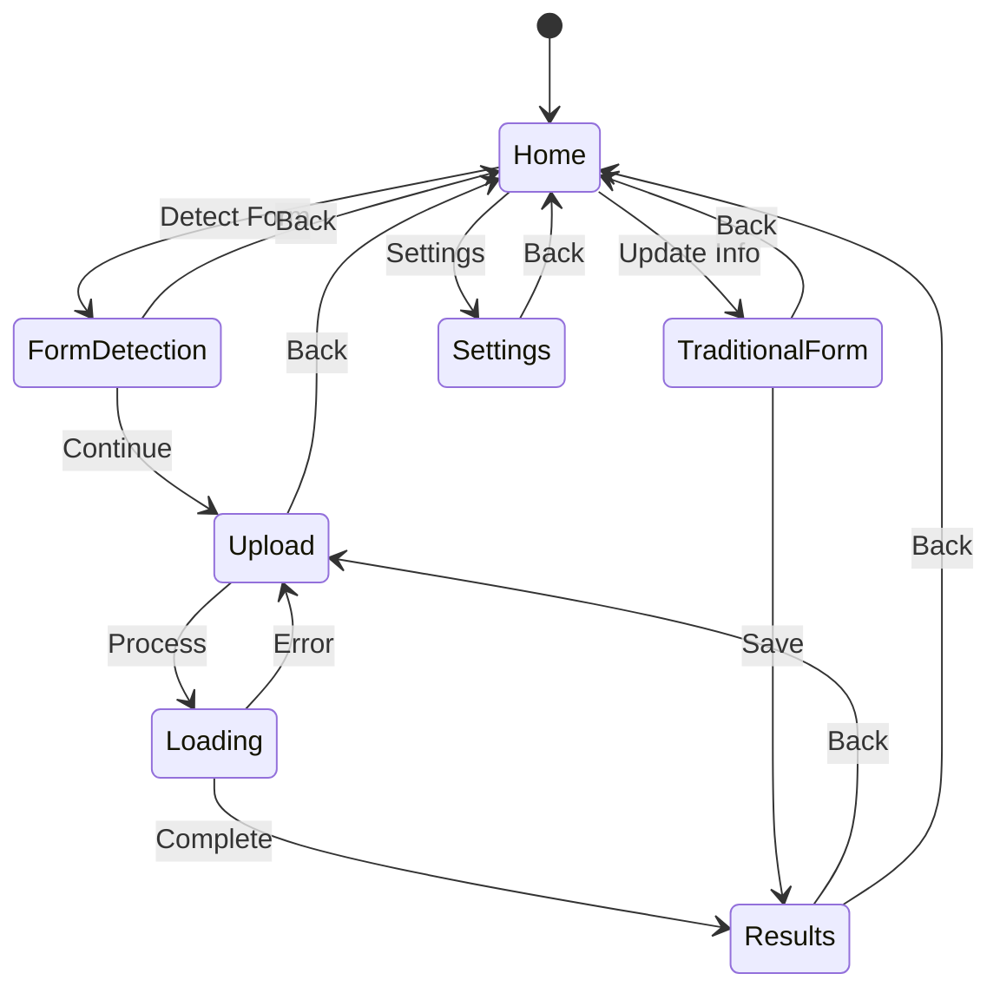
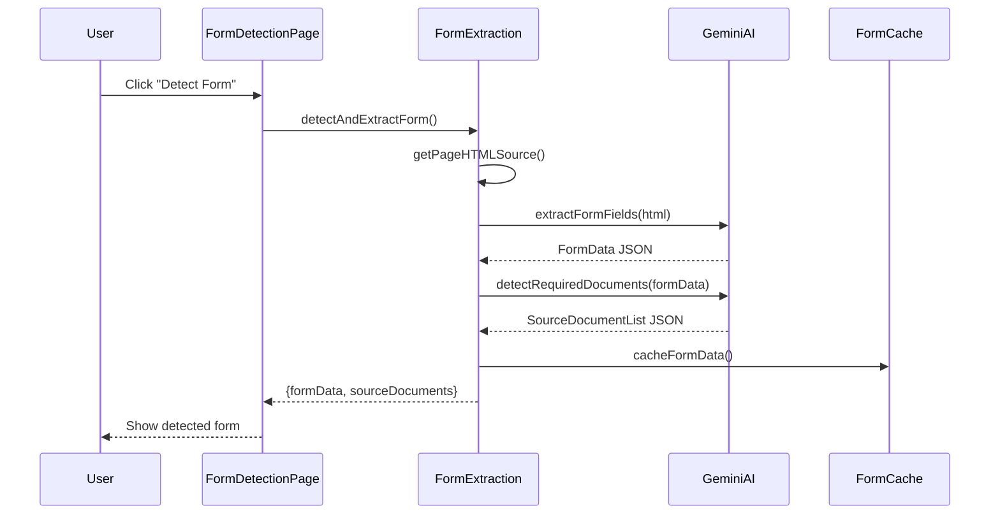
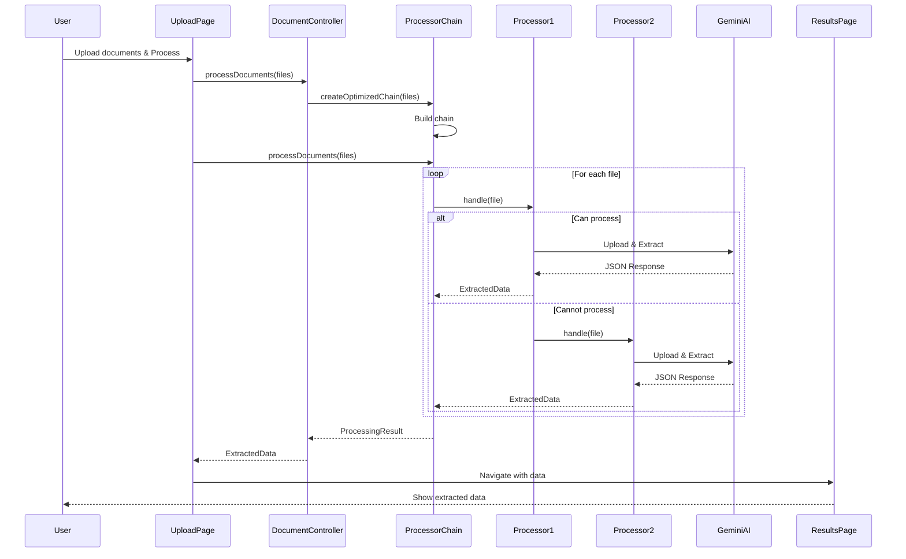
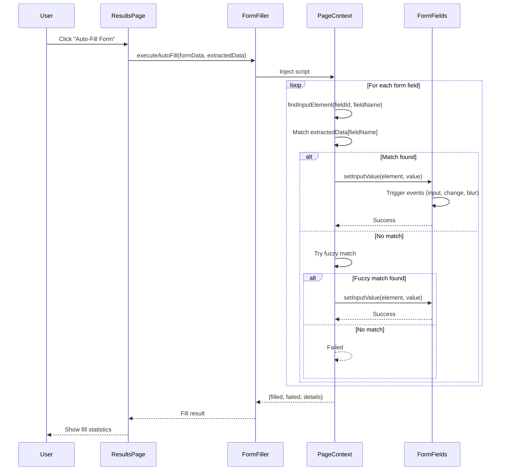
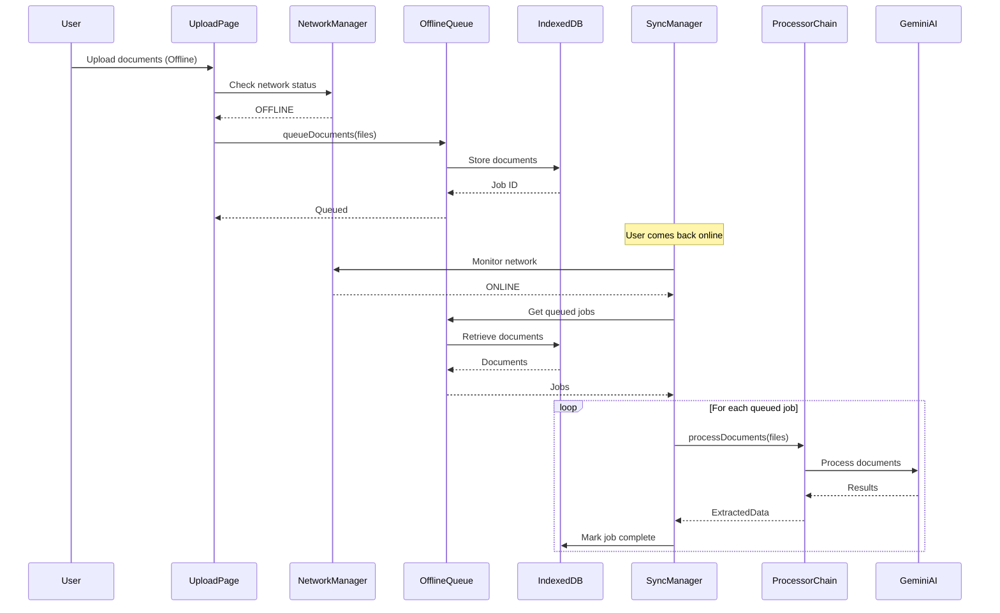

# Architecture Documentation

This document provides a comprehensive overview of the Filr extension architecture, design patterns, component structure, and data flow.

## Table of Contents

1. [System Architecture Overview](#1-system-architecture-overview)
2. [Design Patterns](#2-design-patterns)
3. [Component Architecture](#3-component-architecture)
4. [Data Flow Diagrams](#4-data-flow-diagrams)
5. [File Structure](#5-file-structure)
6. [Key Components](#6-key-components)

---

## 1. System Architecture Overview

### 1.1 High-Level Architecture

The Filr extension follows a modular architecture with clear separation of concerns:

```
┌─────────────────────────────────────────────────────────────┐
│                    Browser Extension                          │
├─────────────────────────────────────────────────────────────┤
│                                                               │
│  ┌──────────────┐    ┌──────────────┐    ┌──────────────┐ │
│  │   Sidepanel  │    │  Background  │    │   Content    │ │
│  │   (React)    │◄───┤   Script     │───►│    Script    │ │
│  └──────────────┘    └──────────────┘    └──────────────┘ │
│         │                    │                    │          │
│         │                    │                    │          │
│         ▼                    ▼                    ▼          │
│  ┌──────────────────────────────────────────────────────┐  │
│  │              Core Library Layer                       │  │
│  │  ┌──────────┐  ┌──────────┐  ┌──────────┐          │  │
│  │  │ Controllers│ │ Processors│ │ Observers │          │  │
│  │  └──────────┘  └──────────┘  └──────────┘          │  │
│  │  ┌──────────┐  ┌──────────┐  ┌──────────┐          │  │
│  │  │ Factories │ │ Singletons│ │ Strategies│          │  │
│  │  └──────────┘  └──────────┘  └──────────┘          │  │
│  └──────────────────────────────────────────────────────┘  │
│         │                                                    │
│         ▼                                                    │
│  ┌──────────────────────────────────────────────────────┐  │
│  │              External Services                         │  │
│  │  ┌──────────────────────────────────────────────┐    │  │
│  │  │         Gemini AI API                        │    │  │
│  │  └──────────────────────────────────────────────┘    │  │
│  │  ┌──────────────────────────────────────────────┐    │  │
│  │  │         IndexedDB (Offline Storage)         │    │  │
│  │  └──────────────────────────────────────────────┘    │  │
│  └──────────────────────────────────────────────────────┘  │
└─────────────────────────────────────────────────────────────┘
```

### 1.2 Component Layers

```
┌─────────────────────────────────────────────────────────┐
│                    Presentation Layer                    │
│  (React Components: Pages, UI Components)              │
├─────────────────────────────────────────────────────────┤
│                    Application Layer                     │
│  (Controllers, State Management, Navigation)             │
├─────────────────────────────────────────────────────────┤
│                    Business Logic Layer                   │
│  (Processors, Factories, Strategies, Observers)         │
├─────────────────────────────────────────────────────────┤
│                    Data Access Layer                      │
│  (API Clients, Storage, Offline Queue)                  │
└─────────────────────────────────────────────────────────┘
```

---

## 2. Design Patterns

The application uses multiple design patterns to ensure maintainability, scalability, and separation of concerns.

### 2.1 MVC (Model-View-Controller) Pattern

**Purpose**: Separates data (Model), presentation (View), and business logic (Controller)

**Implementation**:

- **Models**: `src/models/DocumentModel.ts`
  - `DocumentUploadModel` - Document upload data structure
  - `ApplicationStateModel` - Application state structure
  - `SettingsModel` - Settings data structure
  - `ProcessingResultModel` - Processing result structure

- **Views**: React components in `src/`
  - `UploadPage.tsx` - Document upload view
  - `ResultsPage.tsx` - Results display view
  - `FormDetectionPage.tsx` - Form detection view
  - `SettingsPage.tsx` - Settings view

- **Controllers**: `src/controllers/DocumentController.ts`
  - `DocumentController` - Handles document processing logic
  - `FormController` - Handles form detection and filling
  - `SettingsController` - Handles settings management
  - `NavigationController` - Handles page navigation logic

**Flow**:
```
User Action → View → Controller → Model → Controller → View Update
```

### 2.2 State Pattern

**Purpose**: Manages application state transitions with validation

**Implementation**: `src/lib/state/AppState.ts`

**States**:
- `HomeState` - Initial state
- `FormDetectionState` - Form detection in progress
- `UploadState` - Document upload state
- `LoadingState` - Processing state
- `ResultsState` - Results display state
- `SettingsState` - Settings page state
- `TraditionalFormState` - Manual form entry state

**State Transition Diagram**:


### 2.3 Chain of Responsibility Pattern

**Purpose**: Processes documents through a chain of specialized processors

**Implementation**: `src/lib/processors/ProcessorChain.ts` and `src/lib/processors/DocumentProcessor.ts`

**Chain Structure**:
```
File → BirthCertificateProcessor → NIDProcessor → PassportProcessor → 
       EducationCertificateProcessor → UtilityBillProcessor → Result
```

**Flow**:
1. File enters the chain
2. Each processor checks if it can handle the file (`canProcess()`)
3. If yes, processes it; if no, passes to next processor
4. Results accumulate across processors
5. Final result returned

**Example**:
```typescript
// Each processor implements:
abstract class DocumentProcessor {
  protected next: DocumentProcessor | null = null;
  
  async handle(file: File, data: ExtractedData, ai: GoogleGenAI, model: string) {
    if (this.canProcess(file)) {
      // Process file
      const result = await this.process(file, ai, model);
      data = { ...data, ...result };
    }
    
    // Pass to next processor
    if (this.next) {
      return await this.next.handle(file, data, ai, model);
    }
    
    return data;
  }
}
```

### 2.4 Factory Pattern

**Purpose**: Creates processor chains based on file types or configuration

**Implementation**: `src/lib/factories/ProcessorFactory.ts`

**Methods**:
- `createProcessor(type)` - Create single processor
- `createDefaultChain()` - Create default chain
- `createChain(config)` - Create custom chain
- `createChainForFiles(files)` - Create optimized chain for files

**Example**:
```typescript
// Factory creates chain based on file names
const chain = ProcessorFactory.createChainForFiles(files);
// Automatically infers: birth_certificate.pdf → BirthCertificateProcessor
```

### 2.5 Observer Pattern

**Purpose**: Notifies observers about processing progress

**Implementation**: `src/lib/observers/ProcessingObserver.ts`

**Components**:
- `ProcessingObserver` - Interface for observers
- `ProgressNotifier` - Manages observers and notifications
- `ProgressEvent` - Event structure

**Flow**:
```
Processor → ProgressNotifier → Observer 1 → UI Update
                         └───→ Observer 2 → Logging
                         └───→ Observer 3 → Metrics
```

### 2.6 Singleton Pattern

**Purpose**: Ensures single instance of critical services

**Implementation**: `src/lib/singleton/APIClientSingleton.ts`

**Singletons**:
- `APIClientSingleton` - Single Gemini API client instance
- `SettingsSingleton` - Single settings manager instance
- `MetricsSingleton` - Single metrics collector instance

**Example**:
```typescript
const apiClient = APIClientSingleton.getInstance();
apiClient.initializeClient(apiKey);
// All parts of app use same instance
```

### 2.7 Decorator Pattern

**Purpose**: Adds functionality to processors without modifying them

**Implementation**: `src/lib/decorators/ProcessorDecorator.ts`

**Decorators**:
- `LoggingProcessorDecorator` - Adds logging to processors
- `MetricsProcessorDecorator` - Adds metrics collection
- `RateLimitProcessorDecorator` - Adds rate limiting

**Example**:
```typescript
// Base processor
const processor = new BirthCertificateProcessor();

// Decorate with logging
const loggedProcessor = new LoggingProcessorDecorator(processor);

// Decorate with metrics
const metricsProcessor = new MetricsProcessorDecorator(loggedProcessor);
```

### 2.8 Strategy Pattern

**Purpose**: Allows switching between different extraction strategies

**Implementation**: `src/lib/strategies/ExtractionStrategy.ts`

**Strategies**:
- Static extraction strategy (predefined schema)
- Dynamic extraction strategy (form-based schema)

### 2.9 Prototype Pattern

**Purpose**: Clones document structures for reuse

**Implementation**: `src/lib/prototype/DocumentPrototype.ts`

### 2.10 Command Pattern

**Purpose**: Encapsulates operations as objects

**Implementation**: `src/lib/commands/Command.ts`

**Commands**:
- `ProcessDocumentsCommand` - Encapsulates document processing
- `FillFormCommand` - Encapsulates form filling

---

## 3. Component Architecture

### 3.1 Frontend Architecture

**Technology Stack**:
- **Framework**: React 18+ with TypeScript
- **Build Tool**: WXT (Web Extension Toolkit)
- **Styling**: Tailwind CSS + shadcn/ui components
- **State Management**: State Pattern + React hooks

**Component Hierarchy**:
```
App.tsx
├── HomeView (default)
├── FormDetectionPage
├── UploadPage
│   ├── DocumentUpload components
│   └── QueueStatus
├── ProcessingScreen
│   └── ProgressObserver integration
├── ResultsPage
│   └── ExtractedData display
├── SettingsPage
└── TraditionalFormPage
```

### 3.2 Backend/Service Architecture

**Core Services**:

1. **Document Processing Service**
   - File validation
   - Processor chain execution
   - AI API integration
   - Result aggregation

2. **Form Detection Service**
   - HTML extraction
   - Form field analysis
   - Document requirement detection

3. **Form Filling Service**
   - Field matching
   - Value injection
   - Event triggering

4. **Offline Processing Service**
   - Queue management
   - IndexedDB storage
   - Sync management

### 3.3 Data Flow Architecture

```
User Input → Controller → Service → Processor → AI API
                ↓           ↓          ↓
              State ←── Result ←── Response
                ↓
              View Update
```

---

## 4. Data Flow Diagrams

### 4.1 Form Detection Flow



### 4.2 Document Processing Flow



### 4.3 Form Filling Flow



### 4.4 Offline Processing Flow



---

## 5. File Structure

### 5.1 Directory Structure

```
anirban/
├── entrypoints/              # Extension entry points
│   ├── background.ts        # Background script
│   ├── content.ts           # Content script
│   └── sidepanel/
│       ├── index.html       # Sidepanel HTML
│       └── main.tsx         # Sidepanel entry
│
├── src/                     # Source code
│   ├── App.tsx             # Main app component
│   │
│   ├── components/         # React components
│   │   ├── ui/            # UI components (shadcn)
│   │   ├── NetworkStatusBanner.tsx
│   │   ├── OfflineStatusIndicator.tsx
│   │   ├── QueueStatus.tsx
│   │   └── ToastContainer.tsx
│   │
│   ├── controllers/        # MVC Controllers
│   │   ├── DocumentController.ts
│   │   └── OfflineAwareDocumentController.ts
│   │
│   ├── lib/               # Core library
│   │   ├── commands/     # Command pattern
│   │   ├── decorators/   # Decorator pattern
│   │   ├── factories/    # Factory pattern
│   │   ├── mediators/    # Mediator pattern
│   │   ├── observers/    # Observer pattern
│   │   ├── offline/      # Offline processing
│   │   ├── processors/   # Document processors
│   │   ├── prototype/    # Prototype pattern
│   │   ├── singleton/    # Singleton pattern
│   │   ├── state/        # State pattern
│   │   ├── strategies/   # Strategy pattern
│   │   ├── formExtraction.ts
│   │   ├── formFiller.ts
│   │   ├── gemini.ts
│   │   └── dynamicExtraction.ts
│   │
│   ├── models/           # MVC Models
│   │   └── DocumentModel.ts
│   │
│   ├── views/            # MVC Views
│   │   └── HomeView.tsx
│   │
│   ├── FormDetectionPage.tsx
│   ├── UploadPage.tsx
│   ├── ResultsPage.tsx
│   ├── SettingsPage.tsx
│   └── TraditionalFormPage.tsx
│
├── components/            # Shared UI components
├── docs/                 # Documentation
├── public/               # Static assets
└── styles/               # Global styles
```

### 5.2 Key Files

**Entry Points**:
- `entrypoints/background.ts` - Background service worker
- `entrypoints/sidepanel/main.tsx` - Sidepanel React app entry
- `entrypoints/content.ts` - Content script (minimal)

**Core Logic**:
- `src/lib/formExtraction.ts` - Form detection logic
- `src/lib/formFiller.ts` - Form filling logic
- `src/lib/gemini.ts` - Static document extraction
- `src/lib/dynamicExtraction.ts` - Dynamic document extraction
- `src/lib/processors/ProcessorChain.ts` - Processor chain orchestration
- `src/lib/state/AppState.ts` - State management

**Controllers**:
- `src/controllers/DocumentController.ts` - Document processing controller
- `src/controllers/OfflineAwareDocumentController.ts` - Offline-aware controller

**Processors**:
- `src/lib/processors/BirthCertificateProcessor.ts`
- `src/lib/processors/NIDProcessor.ts`
- `src/lib/processors/PassportProcessor.ts`
- `src/lib/processors/EducationCertificateProcessor.ts`
- `src/lib/processors/UtilityBillProcessor.ts`

---

## 6. Key Components

### 6.1 ProcessorChain

**File**: `src/lib/processors/ProcessorChain.ts`

**Responsibility**: Orchestrates document processing through processor chain

**Key Methods**:
- `processDocuments(files, apiKey, model)` - Process files through chain
- `subscribe(observer)` - Subscribe to progress updates
- `createOptimizedForFiles(files)` - Create optimized chain

### 6.2 DocumentProcessor (Abstract)

**File**: `src/lib/processors/DocumentProcessor.ts`

**Responsibility**: Base class for all document processors

**Key Methods**:
- `canProcess(file)` - Check if processor can handle file
- `process(file, ai, model)` - Process file and extract data
- `handle(file, data, ai, model)` - Chain handler method
- `setNext(processor)` - Set next processor in chain

### 6.3 StateManager

**File**: `src/lib/state/AppState.ts`

**Responsibility**: Manages application state transitions

**Key Methods**:
- `transitionTo(page)` - Transition to new page state
- `getCurrentState()` - Get current state
- `updateContext(updates)` - Update state context
- `getContext()` - Get current context

### 6.4 FormFiller

**File**: `src/lib/formFiller.ts`

**Responsibility**: Auto-fills form fields with extracted data

**Key Methods**:
- `executeAutoFill(formData, extractedData)` - Execute auto-fill
- `findInputElement(fieldId, fieldName)` - Find form field element
- `setInputValue(element, value)` - Set field value with events

### 6.5 OfflineQueue

**File**: `src/lib/offline/SimpleOfflineQueue.ts`

**Responsibility**: Manages offline document queue

**Key Methods**:
- `queueDocuments(files, formData)` - Queue documents for processing
- `processQueue()` - Process queued documents
- `getQueueStatus()` - Get queue status

### 6.6 NetworkStatusManager

**File**: `src/lib/offline/NetworkStatusManager.ts`

**Responsibility**: Monitors network connectivity

**Key Methods**:
- `isOnline()` - Check if online
- `refreshStatus()` - Refresh network status
- `subscribe(callback)` - Subscribe to status changes

---

## 7. Data Structures

### 7.1 FormData

```typescript
interface FormData {
  form_name: string;
  inputs: Array<{
    label: string;
    input_field_id: string;
    input_field_name: string;
  }>;
}
```

### 7.2 SourceDocumentList

```typescript
interface SourceDocumentList {
  form_type_english: string;
  form_type_bangla: string;
  source_documents: Array<{
    file_id: string;
    document_name_english: string;
    document_name_bangla: string;
    fields_provided: string[];
    necessity: "required" | "optional" | "conditional";
    confidence: number;
    notes: string;
  }>;
  additional_notes: string;
}
```

### 7.3 ExtractedData (Static)

```typescript
interface ExtractedData {
  // Birth Certificate
  name_english: string;
  name_bengali: string;
  father_name_english: string;
  father_name_bengali: string;
  mother_name_english: string;
  mother_name_bengali: string;
  date_of_birth: string;
  birth_day: string;
  birth_month: string;
  birth_year: string;
  place_of_birth: string;
  birth_registration_number: string;
  sex: string;
  permanent_address: string;
  
  // Utility Bill
  current_address: string;
  utility_account_number: string;
  
  // Education
  education_board: string;
  ssc_roll_number: string;
  ssc_registration_number: string;
  ssc_passing_year: string;
  institution_name: string;
  
  // NID
  parent_nid_number: string;
  parent_name: string;
  relation: string;
  
  // Other IDs
  passport_number: string;
  tin_number: string;
  driving_license_number: string;
}
```

### 7.4 DynamicExtractedData

```typescript
type DynamicExtractedData = Record<string, string>;
// Keys match form field names/IDs from detected form
```

---

## 8. Extension Architecture

### 8.1 Manifest Structure

**File**: `chrome-mv3/manifest.json`

**Key Components**:
- Background service worker
- Sidepanel UI
- Content scripts (minimal)
- Permissions: `tabs`, `storage`, `scripting`

### 8.2 Communication Flow

```
Sidepanel ←→ Background Script ←→ Content Script ←→ Web Page
    ↓              ↓                    ↓
Storage      API Calls            DOM Manipulation
```

### 8.3 Storage Strategy

- **localStorage**: Settings, API keys, form cache
- **IndexedDB**: Offline document queue, processing jobs
- **Session Storage**: Temporary state (optional)

---

## 9. Error Handling

### 9.1 Error Recovery Strategy

**File**: `src/lib/processors/ProcessorValidator.ts`

**Strategies**:
- Retry logic for API failures
- Fallback processors for unrecognized files
- Graceful degradation for partial extraction

### 9.2 Error Types

1. **Validation Errors**: Invalid files, missing API key
2. **Processing Errors**: AI API failures, parsing errors
3. **Network Errors**: Offline detection, sync failures
4. **Form Filling Errors**: Field not found, value mismatch

---

## 10. Performance Considerations

### 10.1 Optimization Strategies

1. **Processor Chain Optimization**: Only create processors for detected file types
2. **Lazy Loading**: Load processors on demand
3. **Caching**: Cache form detection results
4. **Batch Processing**: Process multiple files efficiently
5. **Offline Queue**: Queue documents when offline, process when online

### 10.2 Resource Management

- **API Rate Limiting**: Decorator pattern for rate limiting
- **Memory Management**: Clean up uploaded files after processing
- **Storage Cleanup**: Auto-delete expired queued documents (24 hours)

---

## Summary

The Filr extension architecture is built on solid design principles:

- **Separation of Concerns**: MVC pattern separates data, logic, and presentation
- **Extensibility**: Factory and Strategy patterns allow easy addition of new processors
- **Maintainability**: Clear component boundaries and single responsibility
- **Reliability**: Chain of Responsibility and Observer patterns ensure robust processing
- **User Experience**: State pattern manages smooth navigation, offline support ensures availability

The architecture supports both static (predefined) and dynamic (form-detected) extraction modes, providing flexibility for various government forms while maintaining backwards compatibility.


